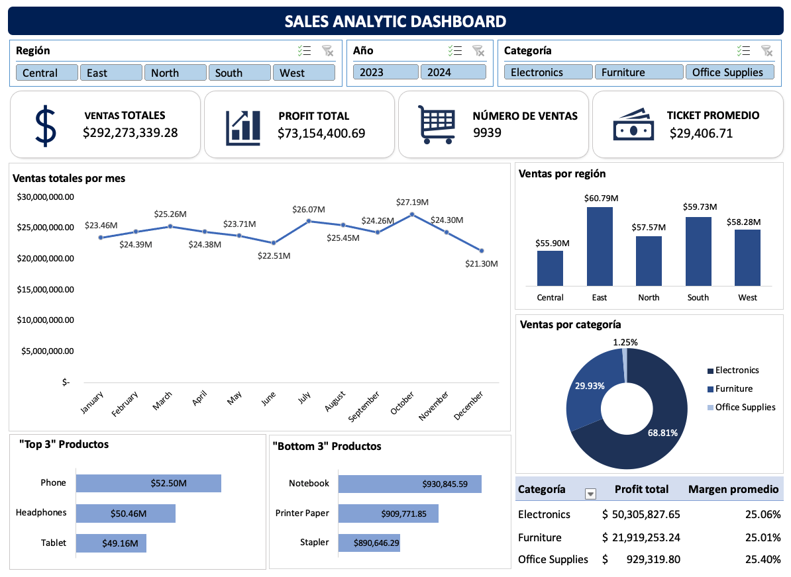
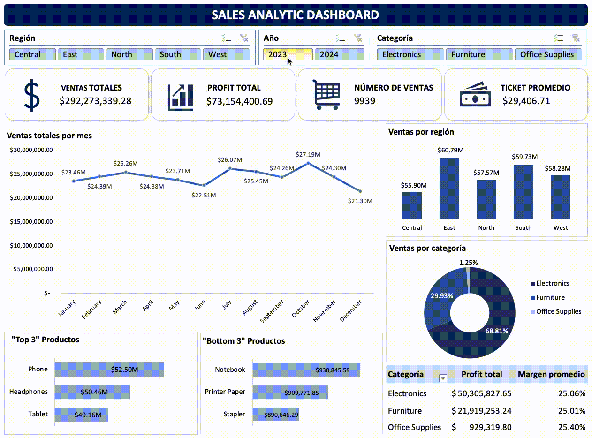

# Sales Analytics Dashboard in Excel

An interactive Excel dashboard developed for sales data analysis, KPI tracking, and business insights generation. This project simulates a real-world analytics workflow including transformation, pivot analysis, dashboard design, and basic automation concepts.

## Project Objective

The goal of this project is to analyze sales performance and customer behavior through an interactive dashboard built entirely in Excel.

The dashboard enables users to:

- Monitor sales performance
- Analyze trends over time
- Identify top-performing products
- Compare categories and regions
- Track profitability metrics
- Interact dynamically using filters

## Project Structure

This workbook follows a professional layered workflow:

### Clean_Data
Contains transformed and prepared data.

Data preparation tasks include:

- Month and Year extraction
- Margin calculation
- Data standardization

Tools used:

- Excel formulas
- Power Query

### Pivot_Tables
Contains all pivot tables used as the analytical engine.

Examples:

- Sales by Month
- Sales by Region
- Sales by Category
- Top Products
- Profit by Category
- KPI calculations

### Dashboard
Final interactive dashboard for business analysis.

Includes:

- KPI cards
- Interactive slicers
- Dynamic charts
- Sales trends
- Regional analysis
- Product performance analysis

## Dashboard Features

### KPIs

- Total Sales (MXN)
- Total Profit (MXN)
- Number of Orders
- Average Ticket Value

### Visualizations

- Monthly Sales Trend
- Sales by Region
- Sales by Category
- Top Products
- Profit Analysis

### Interactivity

Users can filter dashboard elements through:

- Region
- Category
- Year

using slicers and timeline controls.

## Metrics Used

### Total Sales

Sales were calculated using:

Quantity × Unit Price × (1 − Discount)

---

### Profit

Profit values were generated using simulated business margins.

### Margin

Margin:

Profit / Total Sales

### Average Ticket

Average Ticket:

Total Sales / Number of Orders

## Dataset Characteristics

Synthetic dataset with:

- 9939 records
- MXN currency values
- Multiple product categories
- Category-specific pricing ranges
- Discounts
- Profit calculations
- Regional segmentation
- Time series data

## Tools Used

- Microsoft Excel
- Pivot Tables
- Power Query
- Excel Formulas
- Slicers
- Interactive Charts
- Dashboard Design

## Key Skills Demonstrated

- Data Cleaning
- Data Transformation
- Exploratory Analysis
- Dashboard Design
- KPI Development
- Business Analysis
- Data Visualization

## Dashboard Preview
Example:

